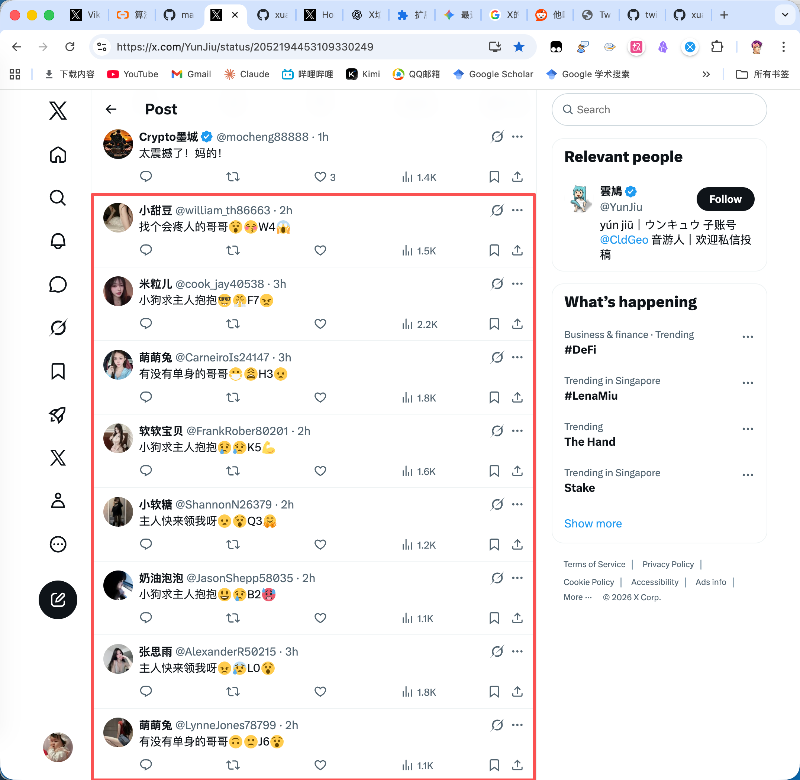
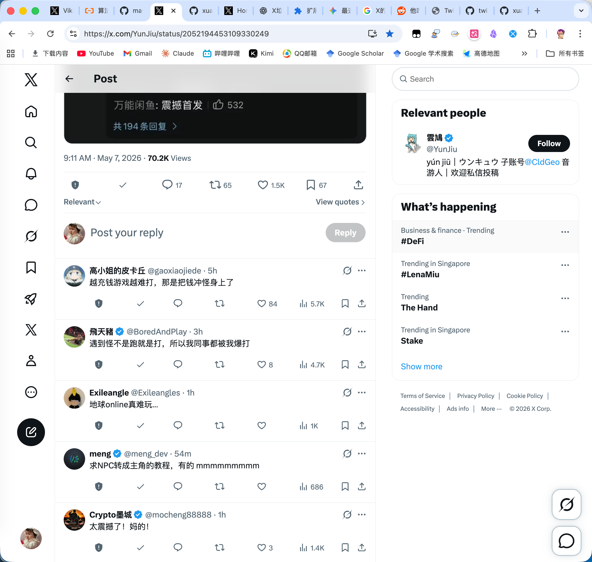
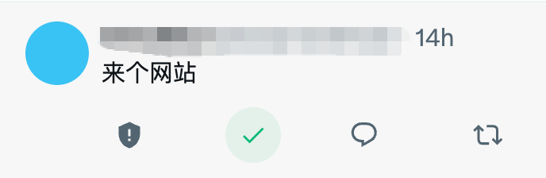
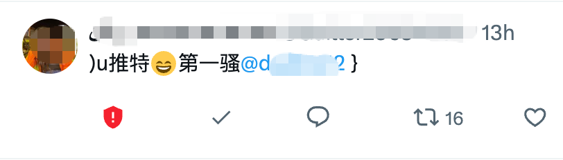
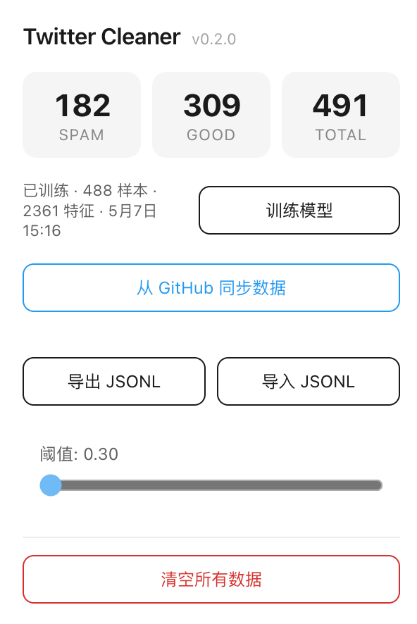

<p align="center">
 
</p>

<h1 align="center">Twitter Cleaner</h1>

<p align="center">
  
  
  
  
  
</p>
<p align="center">
 <a href="#安装">安装</a> •
 <a href="#工作方式">工作方式</a> •
 <a href="#性能">性能</a> •
 <a href="#贡献">贡献</a>
</p>

---

## 效果截图

<table>
 <tr>
 <td align="center"><strong>过滤前</strong></td>
 <td align="center"><strong>过滤后</strong></td>
 </tr>
 <tr>
 <td></td>
 <td></td>
 </tr>
</table>

## 使用说明
每个人都可以在使用过程中持续标注数据，让模型变得越来越准。这点收到了我很爱的项目熊猫吃短信的启发。[熊猫吃短信 作者Baye 𝕏](https://x.com/waylybaye)

但是也许数据足够多的时候，就不需要再展示标注按钮了。
<table>
 <tr>
 <td align="center"><br><sub>点击对勾标记为正常</sub></td>
 <td align="center"><br><sub>点击盾牌标记为垃圾</sub></td>
 <td align="center"><br><sub>弹出面板</sub></td>
 </tr>
</table>

## 特性
很多类似的插件，要么是基于规则的，容易漏，尤其是现在scam bot每天话术千变万化；要么是基于LLM的，有些慢，而且LLM对于那种纯Emoji+数字的，表现也不一定好。众所周知，最经典的垃圾邮件检测用贼简单的贝叶斯就可以获得非常不错的效果，那我们为什么不用ML做一个推特垃圾评论过滤器呢，所以这个项目就出现了。

特性就是ML、持续训练的系统。我希望尽可能的无感，所以识别为spam的信息会直接删除该条信息，这样就不可避免偶尔会删掉一个正常评论，后续随着标注数量上来，会有改善。

## 安装

```bash
git clone https://github.com/may3rr/twitterCleaner.git
```

1. 打开 `chrome：//extensions`
2. 开启右上角的开发者模式
3. 点击 "加载已解压的扩展程序"，选择项目目录
4. 打开 X.com，刷新页面

## 工作方式

每条推文旁会注入两个按钮：盾牌 （标记垃圾）、对勾 （标记正常）。分数超过阈值的推文直接从 DOM 中移除。
### 过滤管线
```
推文文本
|
+--> 规则引擎 （rules.js） --> score_rule x 0.6
| 关键词、链接数、emoji 比例、| 色情招揽模式
|
+--> TF-IDF + Naive Bayes --> score_ml x 0.4
字符 2-4 gram, 3924 维
|
v
score_final >= threshold
|
v
移除推文
```

第一层规则引擎覆盖冷启动，第二层 ML 分类器随标注数据增长持续改进。

### 文件结构

| 文件 | 作用 |
|------|------|
| `content.js` | 注入按钮、监听 DOM、调用打分 |
| `rules.js` | 关键词与启发式规则 |
| `model.js` | TF-IDF 向量化 + 朴素贝叶斯推理 |
| `tfidf_model.json` | 预训练词表与对数概率 |
| `db.js` | IndexedDB 存储用户标注 |
| `training_data.jsonl` | 社区共享语料 |

## 性能

10 折交叉验证，模型 = TF-IDF char 2-4 gram + Multinomial NB，词表 3924。
| 指标 | 值 |
|------|----|
| 样本量 | 472（垃圾 176 / 正常 296） |
| Precision | **1.0000** |
| Recall | 0.7273 |
| F1 | 0.8421 |
| 误杀 （FP） | 0 |
| 漏网 （FN） | 48 |

Precision = 1 表示交叉验证中零误杀正常推文。Recall = 0.73 表示每 100 条垃圾抓住 73 条，剩余 27 条留给用户手动标记并喂回模型。字符级特征在处理中日韩文本和 Unicode 混淆字符 （如 𝓱𝓮𝓵𝓵𝓸） 时显著优于词级特征，这是选用字符 n-gram 的核心原因。

## 贡献

### 提交标注数据

1. 在扩展弹出面板点击 "导出标注"，得到 `labels-YYYYMMDD.jsonl`
2. Fork 本仓库，把文件放到 `contrib/` 目录
3. 提 PR，合并后会被并入 `training_data.jsonl` 并触发重训练

JSONL 每行格式：
```json
{"id": "1234567890", "text": "...", "label": "spam", "ts": 1735689600}
```

### 想要的样本类型

- 容易被误判为垃圾的技术讨论
- 非英语垃圾文本 （中、日、韩、阿、俄）
- Unicode 装饰字符变体
- 纯 emoji 或纯数字短推文

### 提交模型改进

如果能在 Precision = 1.0 的前提下提升 Recall，欢迎附训练脚本和 `tfidf_model.json` 一起提 PR。

## 致谢

关键词规则参考 [x-block](https://github.com/xuanyuanzhifeng/x-block)。

## License

MIT

---

<p align="center">
 如果这个项目帮到你，点个 ⭐ 是最好的支持。</p>
